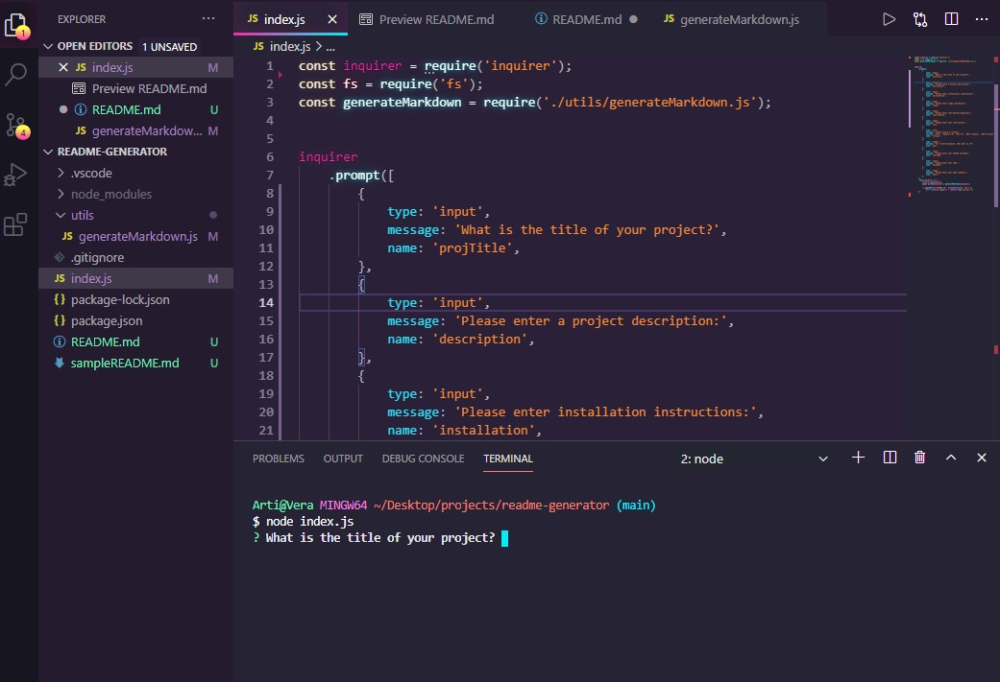
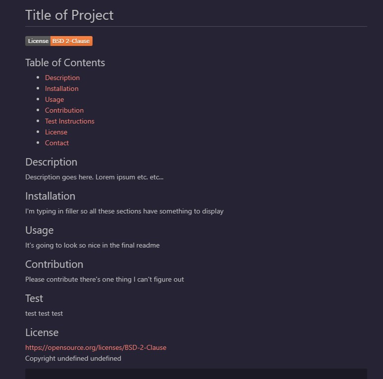

# README Generator

Using Node.js and [inquirer](https://www.npmjs.com/package/inquirer), this command line app gives a series of prompts and uses them to generate a professional-looking README.md file.  
  

## Prompts for...
- Title of Project
- A Description
- Installation Instructions
- Usage Information
- Contributor Guidelines
- Test Instructions
- Select a License from a list
- Enter the current year (for the license)
- GitHub Username
- Name
- Email

And uses that information to generate...

## Professional README file
- Title
- License badge (thanks to @lukas-h for an easy-to-use list of badges)
- Table of Contents (links scroll to the corresponding section when clicked)
- ...and sections for Description, Installation, Usage, Test instructions, License, and Contact info

The only thing I couldn't nail down is generating the name and year into the copyright statement in the license text.

[Demo Video](https://www.youtube.com/watch?v=dsPYMw6DipU)

